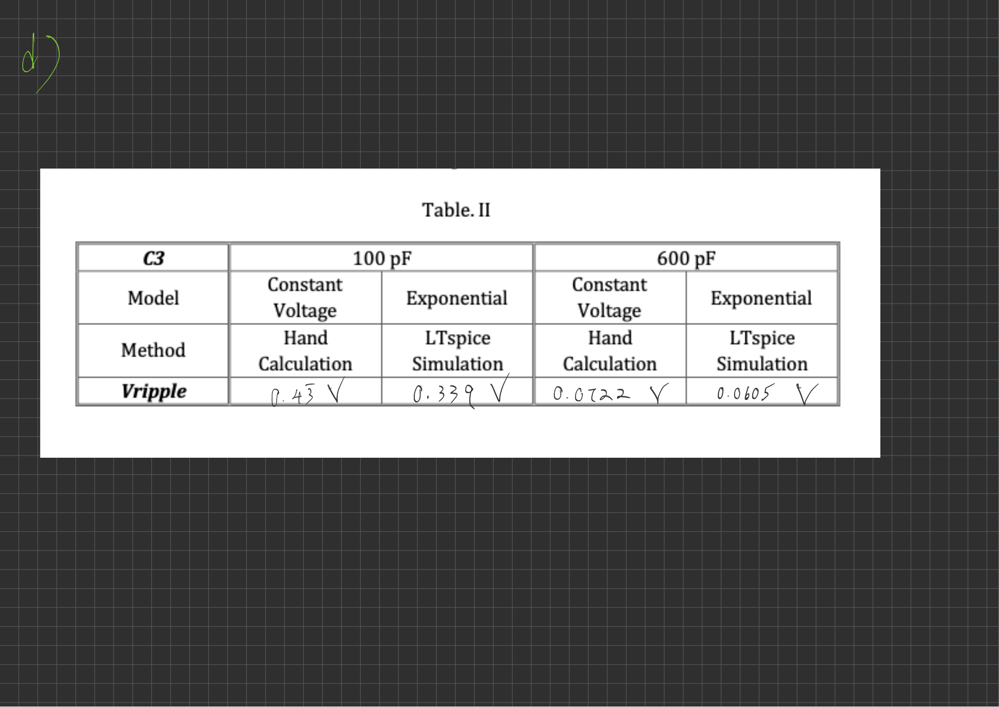
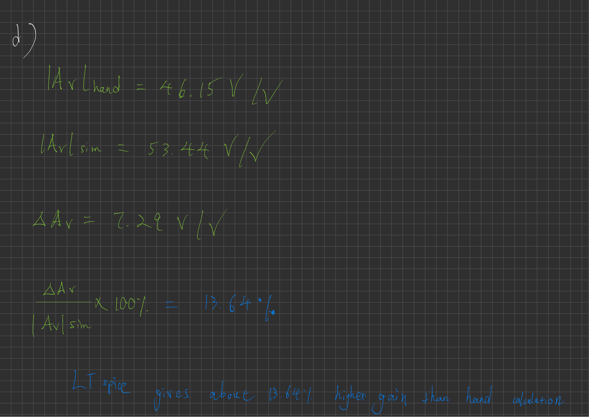
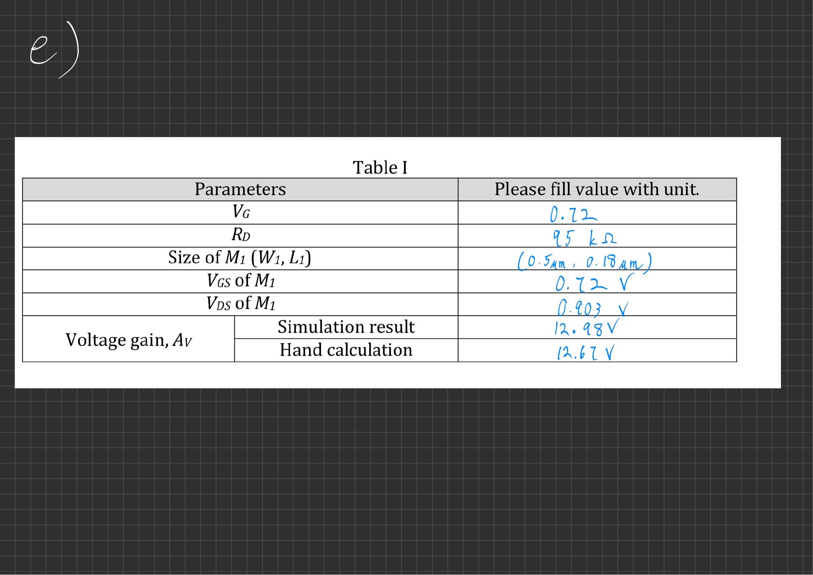
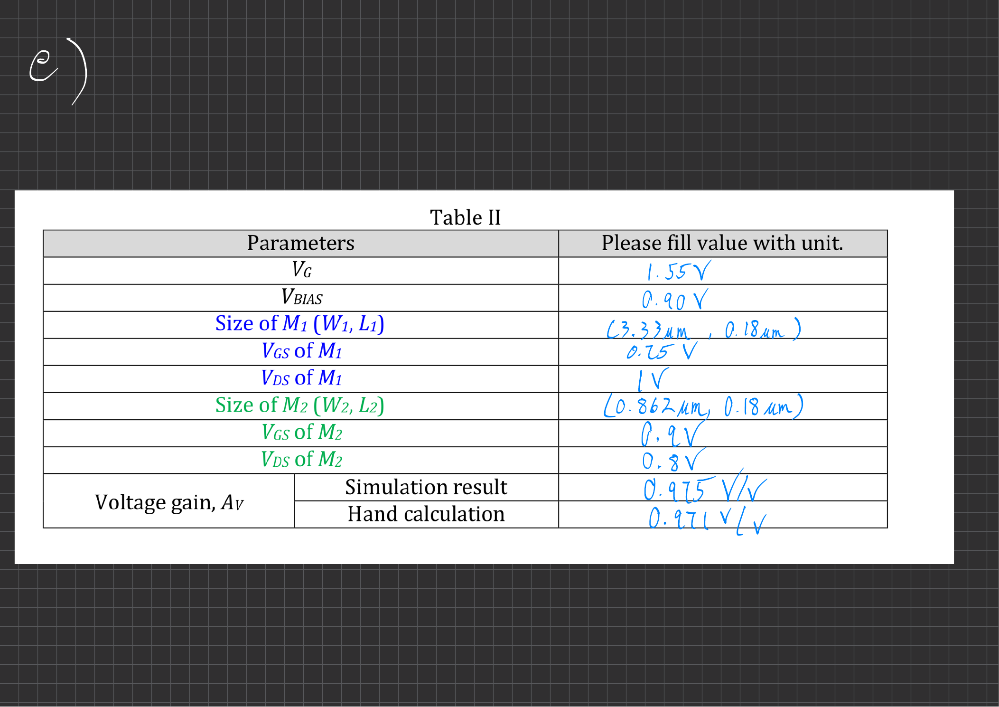

# Analog Electronics Design and LTspice Validation

A preserved portfolio of hand analysis and LTspice simulation work covering diode circuits, BJT amplifiers, and MOSFET amplifiers.

The repository presents three related analog-electronics studies as one progression:

1. **Diode circuits and nonlinear transfer behavior**
2. **BJT common-emitter and common-collector amplifier design**
3. **NMOS common-source and common-drain amplifier design**

The work was completed in an academic electronics course. The original submission PDFs, LTspice schematics, and screenshots are retained as evidence of the analysis process. No original circuit file or submission document has been edited.

## Technical scope

| Project | Main topics | Evidence |
|---|---|---|
| [Diode circuits](projects/01-diode-circuits/) | Exponential diode model, large- and small-signal analysis, full-wave rectification, capacitor ripple, nonlinear transfer curves | Hand calculations, DC/transient LTspice simulations, four `.asc` files |
| [BJT amplifiers](projects/02-bjt-amplifiers/) | Bias design, active-region checks, common-emitter gain, emitter-follower gain, simulation-to-calculation comparison | Two LTspice designs and a 14-page submission |
| [MOSFET amplifiers](projects/03-mosfet-amplifiers/) | Device sizing, saturation-region checks, channel-length modulation, common-source gain, source-follower gain | Two LTspice designs and a 17-page submission |

## Selected results

### Rectifier ripple versus capacitance

The full-wave rectifier study compared hand estimates with transient LTspice results at two capacitor values:

| Filter capacitor | Hand calculation | LTspice simulation |
|---:|---:|---:|
| 100 pF | 0.43 V | 0.339 V |
| 600 pF | 0.0722 V | 0.0605 V |



### BJT amplifier gain

The common-emitter design used a 2.5 V supply, 30 kOhm collector resistance, and a 0.653 V DC input bias. The submission records a hand-calculated gain of 46.15 V/V and a simulated gain of 53.44 V/V. The emitter-follower design records approximately 0.955 V/V in both calculation and simulation.



### MOSFET amplifier gain

The common-source design used a 1.8 V supply, 95 kOhm drain resistance, 0.72 V gate bias, and a 0.5 um / 0.18 um NMOS. The submission records 12.67 V/V by hand calculation and 12.98 V/V in simulation.



The common-drain design used two NMOS devices and records 0.971 V/V by hand calculation and 0.975 V/V in simulation.



## Repository structure

```text
analog-electronics-ltspice-analysis/
├── README.md
├── ORIGINAL_FILE_MANIFEST.tsv
├── PRESERVATION_POLICY.md
├── assets/                         # Derived previews rendered from original PDFs
├── docs/
│   ├── EXCLUDED_FILES.md
│   └── VERIFICATION.md
└── projects/
    ├── 01-diode-circuits/
    ├── 02-bjt-amplifiers/
    └── 03-mosfet-amplifiers/
```

Each project contains:

- `submission/submission.pdf` - the original submitted report, renamed only at the filesystem level to avoid exposing the student number in the GitHub path;
- `ltspice/` - original `.asc` circuit files;
- `evidence/` - original screenshots retained unchanged; and
- a project README describing what the files demonstrate.

## Tools and methods

- **LTspice** for DC operating-point, DC sweep, and transient simulation
- **Hand analysis** using diode, BJT, and MOSFET device models
- **Small-signal models** for amplifier gain estimation
- **Operating-region verification** for BJT active mode and MOSFET saturation
- **Waveform cursors** for extracting amplitudes, ripple voltage, and bias conditions

## Source integrity

All included source artifacts are byte-for-byte copies of the uploaded files. SHA-256 hashes are recorded in [`ORIGINAL_FILE_MANIFEST.tsv`](ORIGINAL_FILE_MANIFEST.tsv).

See [`PRESERVATION_POLICY.md`](PRESERVATION_POLICY.md) for the exact editing boundary.

## Limitations

- The work is based on idealized or simplified device models supplied for the exercises.
- Results are simulation-based and were not validated on physical hardware.
- The repository preserves the original calculations and conclusions; it does not silently correct or reinterpret them.
- LTspice was not available in the packaging environment, so the simulations were not rerun during repository assembly.
